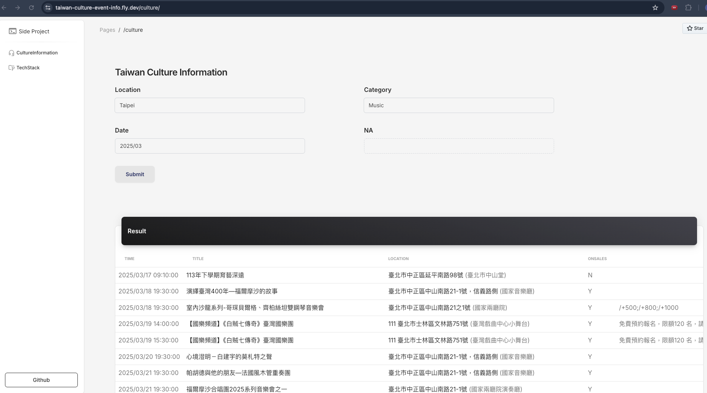
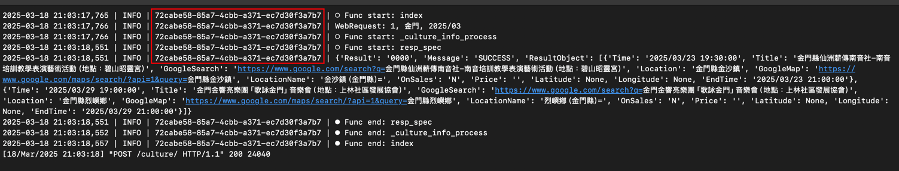
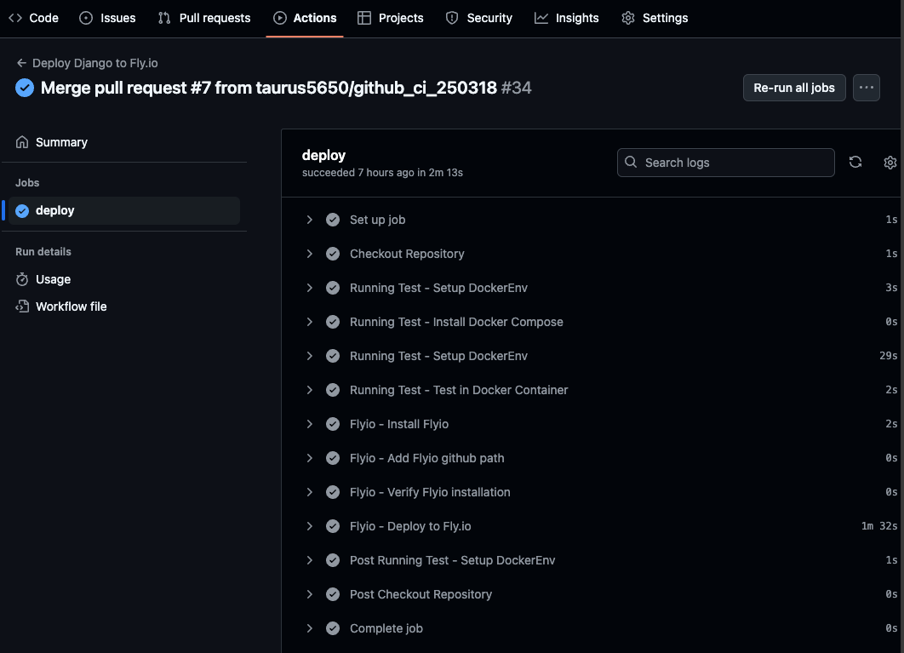

# Taiwan Culture Event Information

This website through by MoC (Ministry of Culture) open data to get event information.
- Orchestra concert
- Thearter
- Exhibition
- etc.

### Web Url
https://taiwan-culture-event-info.fly.dev/



### Tech Stack
https://taiwan-culture-event-info.fly.dev/tech_stack/ <br>

|              |         |
|----------------------|------------------|
| Backend             | Python Django    |
| Frontend            | JinJa2    |
| Unit Test           | Pytest           |
| Containerization    | Docker           |
| CI/CD               | GitHub Actions   |
| Deployment Server   | Fly.io          |
| Bootstrap Template  | Creative Tim     |
| TW Culture Info     | MoC OpenData     |

## Dev Mode, Deployment, Debug

### Dev Mode
Option 1. Docker environment
```commandline
$ make run-dev-docker
```

Option 2. Docker environment with HTTPS
```commandline
$ make run-dev-docker-ngrok
```

Option 3. Local environment
```commandline
$ make run-dev
```

### Debug
Which have same `request_id` in one workflow. <br>


### Deployment
PR merged to master -> github actions (running unit test, set up Flyio) -> Fly io <br>



